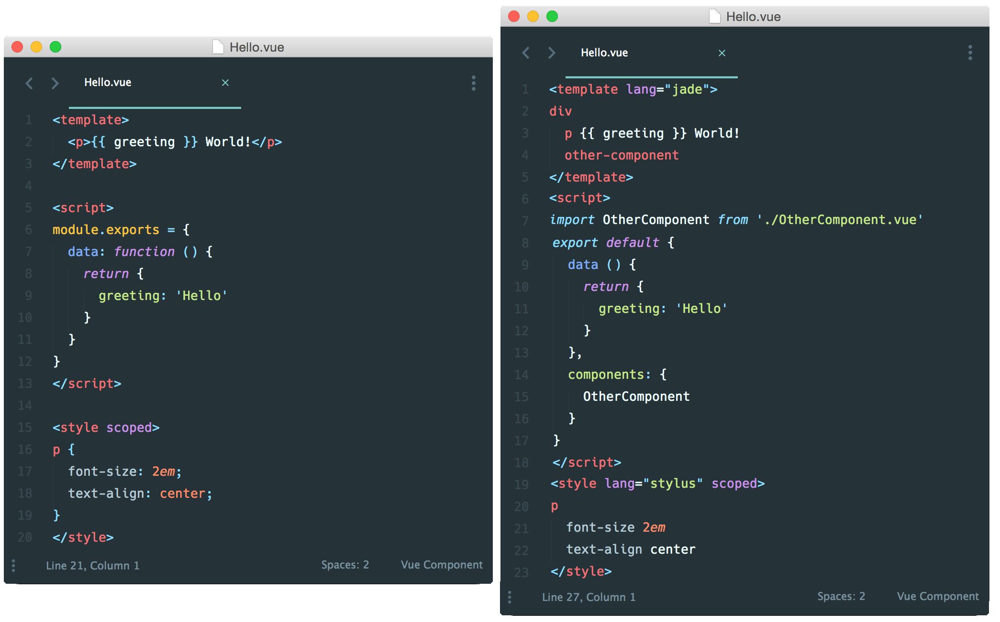
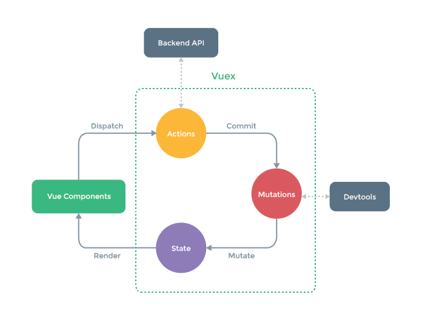

# Mi charla sobre Vue.JS

The Progressive JavaScript Framework.

Pagina oficial: [vuejs.org](http://vuejs.org) [doc en español](http://es-vuejs.github.io/vuejs.org/)

Mi presentación online [vuejs-talk-2017](http://maranimatias.github.io/vuejs-talk-2017)

[Video de la charla](https://www.youtube.com/watch?v=V7d7apaRPGU&index=2&list=PLLA9AGYZ1alD2RwoCMsnfL-p0iVl_oTLm) en [EmprenDevs](http://emprendevs.com)

## Contenido de la charla

### Un poco de historia.

Creado por Evan You, cuando estaba trabajando en Google Creative Labs.

Evan You:
>"I figured, what if I could just extract the part that I really liked about Angular and bulid something really lightweight without all the extra concepts involved?"

#### ¿Qué es Vue?
* Es un Framework JavaScript código abierto para construir interfaces de usuario
* Enfocado en el patron [MV-viewModel](http://en.wikipedia.org/wiki/Model%E2%80%93view%E2%80%93viewmodel)
* Posee conceptos de Angular y React
* Con menor complejidad
* Primer lanzamiento en 2014, la v2 en abril del 2016

#### Tendencia de Github star


Fuente [timqian.com/star-history](http://www.timqian.com/star-history/#facebook/react&angular/angular&vuejs/vue&angular/angular.js) [npmtrends](https://www.npmtrends.com/@angular/core-vs-vue) ~[Github Trending](https://github.com/trending)~


#### Lo más importante
<p class="fragment">Progresivo.</p>
<p class="fragment">Renderizado declarativo.</p>
<p class="fragment">Reactivo.</p>
<p class="fragment">Componente functional.</p>

## Vamos al código :D

### Basic App Vue

```html
<body>
  <div id="app">
    <h1>{{ message }}</h1>
    <input v-model="message">
  </div>
  <script>
  var app = new Vue({
    el: '#app',
    data: {
      message: 'Welcome to your Vue.js app!'
    }
  })
  </script>
<body>
```

### Un Componente Vue
```javascript
Vue.component('hello-component', {
  template: '#hello',
  data: function () {
    return {
      message: 'Welcome to your Vue.js app!'
    }
  }
});
```
```html
<template id="hello">
  <div>
    <h1>{{ message }}</h1>
    <input v-model="message">
  </div>
</template>
```
```html
<body>
  <div id="app">
    <hello-component></hello-component>
  </div>
</body>
```

### Métodos

```html
<template id="hello">
  <div>
    <h1>{{ message }}</h1>
    <button v-on:click="change('message')">change</button>
  </div>
</template>
```
```javascript
Vue.component('hello-component', {
  template: '#hello',
  data: function () {
    return { message: 'Welcome to your Vue.js app!' }
  },
  methods: {
    change: function(value) {
      this.message = "new " + value;
    }
  }
});
```

### Eventos

Eventos click

```html
<button v-on:click="message = 'yo'">Change message</button>

<button @click="message = 'yo'">Change message</button>
```

Eventos para teclas

```html
<input v-on:keyup.enter="submit()">

<input @keyup.alt.67="clear()">

<div @click.ctrl="doSomething()">Do something</div>
```

El evento submit no recargara la pagina.

```html
<form v-on:submit.prevent="onSubmit()"></form>
```

### Propiedades calculadas
```html
<template id="hello">
  <div>
    <p>Original message: "{{ message }}"</p>
    <p>Computed reversed message: "{{ reversedMessage }}"</p>
  </div>
</template>
```
```javascript
Vue.component('hello-component', {
  template: '#hello',
  data: function () {
    return { message: 'Welcome to your Vue.js app!' }
  },
  methods: { /* ... */ },
  computed: {
    reversedMessage: function () {
      return this.message.split('').reverse().join('')
    }
  }
});
```

### Ciclo de vida de un Componente


Usar los eventos en nuestro componente

```javascript
Vue.component('hello-component', {
  template: '#hello',
  data: function () {
    return { message: 'Welcome to your Vue.js app!' }
  },
  methods: { /* ... */ },
  computed: { /* ... */ },
  beforeCreate: function(){ /* ... */ },
  created: function(){ /* ... */ },
  beforeMount: function(){ /* ... */ },
  mounted: function(){ /* ... */ }
  beforeUpdate: function(){ /* ... */ },
  updated: function(){ /* ... */ }
});
```

### Directives && Filters

Directivas de control de flujo

```html
<p v-if="Math.random() > 0.5"> Mayor </p>
<p v-else> Menor </p>
```

```html
<div v-show="Math.random() > 0.5">
  <p> Math.random() Mayor que 0.5</p>
</div>
```

```html
<ul>
  <li v-for="item in items">
      {{ item.message }}
    </li>
    <li v-for="(item, index) in items">
      {{ parentMessage +" - "+ index +" - "+ item.message }}
  </li>
</ul>
```

```html
<div v-for="(value, key) in object">
  {{ key + ": " + value }}
</div>
```

Atributos vinculados HTML

```html


```
o sintaxis abreviada __:__

```html

```

Directivas personalizadas

```html
<input v-focus>
```
```javascript
// Register a global custom directive called v-focus
Vue.directive('focus', {
  inserted: function (el) {
    el.focus();
  }
})
```
Podemos declara directivas locales para cada componente.

Filtros
```html
<p>{{ message | capitalize }}</p>
```

```javascript
Vue.filter('capitalize', function (value) {
  if (!value) return '';
  value = value.toString();
  return value.charAt(0).toUpperCase() + value.slice(1);
});
```

Plugin de Filter

[morphling](https://github.com/jofftiquez/morphling)

[vue2-filters](https://github.com/freearhey/vue2-filters)

[vue-currency-filter](https://github.com/jofftiquez/morphling)

### Componentes padres e hijos

Comunicación entre padres e hijos.


Eventos Personalizados

```html
<template id="parent">
  <child v-bind:clicks="count" v-on:count="mParent"></child>
  <child :clicks="count" @count="mParent"></child>
</template>
```

```javascript
Vue.component('parent', {
  template: '#parent',
  data: function () { return { count: 0 } },
  methods: {
    mParent: function (value) { this.count += value; }
  }
});
Vue.component('child', {
  props: ['clicks'],
  template: '<button @click="mChild">{{clicks}}</button>',
  methods: {
    mChild: function () { this.$emit('count', 5); }
  }
});
```

Comunicación entre componentes sin parentesco

```javascript
var bus = new Vue()

// in component A's method
bus.$emit('id-selected', 1)

// in component B's created hook
bus.$on('id-selected', function (id) {
// ...
})
```

Slots

```html
<div id="app">
  <h1>el título de padre</h1>
  <mi-component>
    <h3>Titulo</h3>
    <p> Se mostrará dentro de Slot </p>
  </mi-component>
</div>
```
```html
<template id="mi-component">
  <h2>el título del hijo</h2>
  <slot>
    Esto sólo se mostrará si no hay contenido
  </slot>
</template>
```

### vue-cli

Para la base del proyecto con webpack completo
```shell
npm install --global vue-cli

vue init webpack my-project

cd my-project
npm install
npm run dev
```

Para un proyecto simple
```shell
npm install --global vue-cli

vue init simple my-project

cd my-project
npm install
npm run dev
```

Recomendación para persona que recién inician en este mundo del front-end usar la plantilla `vue init simple my-project` y si tienes algún conocimiento básico de npm y webpack  `vue init webpack-simple my-project`

### DevTool

Muy útil para entender como esta armada nuestra pag. y la estructura de nuestros componentes

[lick para descargar](https://github.com/vuejs/vue-devtools#installation)

### Componentes de un solo archivo. (.vue)

Es un xml con tres partes, estructura de la vista, modela y lógica, estilos de la vista.



### Librerías || Plugins

Lista de plugins oficiales

[vue-router](https://router.vuejs.org/en/)

[vuex](https://vuex.vuejs.org/en/)

[vue-touch](https://github.com/vuejs/vue-touch)

[vue-rx](https://github.com/vuejs/vue-rx)

```javascript
var Vuex = require('vuex');
Vue.use(Vuex);
```

# Vuex

Merece un análisis aparte, la idea es que al tener muchos componentes que requieran tener la misma información se usa un lugar común para que acedan, `state`

_en el [video de la charla](https://youtu.be/V7d7apaRPGU?list=PLLA9AGYZ1alD2RwoCMsnfL-p0iVl_oTLm&t=1243) esta mejor explicado_




# Bibliografía

[vuejs.org](https://vuejs.org/)

[The Majesty of Vue.js 2](https://leanpub.com/vuejs2)

[Learning Vue.js 2](https://www.packtpub.com/web-development/learning-vuejs-2)

[awesome-vue](https://github.com/vuejs/awesome-vue)

[Tutorial](https://github.com/MaraniMatias/learn-vue)
